# 第一堂:視覺模型基礎 — CNN， ResNet， YOLO
**目標:讓學弟們真正搞懂「電腦怎麼看圖」，從 CNN 的直覺出發，理解每一代架構在解決什麼問題，最後能自己刻一個 YOLO**

[互動式網頁](https://lesson1-computer-vision.pages.dev/web/)

---

## 課程節奏總覽

| 段落  | 內容 | 詳細內容 |
|-----|------|----------|
| 簡介 | 為什麼要學這個 | 你覺得電腦看圖跟人類有什麼不同 |
| CNN 完整複習 | Convolution / Pooling / FC，以及輔助組件 | 互動網頁:Convolution Playground |
| 訓練的本質 | 梯度、梯度下降、優化器、模擬退火 | 互動網頁:Gradient Descent Playground |
| ResNet 全變體 | 梯度消失、Skip Connection、Basic vs Bottleneck、Pre-activation | 互動網頁:Gradient Vanishing Demo |
| YOLO 系列演進 | v1 ~ v8 完整演進，每代解決什麼問題 | 互動網頁:YOLO Anchor Visualizer |
| PyTorch 實作 | nn.Module / forward / 訓練流程 | 互動網頁:PyTorch Model Builder |
| Q&A + 作業說明 | 作業要求、評分重點 | — |

---

## 0. 開場
開場不要急著進技術，先丟一個問題給大家:

> 「如果你今天要寫一個程式，告訴電腦『這張圖裡有沒有貓』，你會怎麼寫?」

讓學弟思考 30 秒，可能的答案:
- 「找毛?」 → 那毛要怎麼定義?
- 「找耳朵?」 → 耳朵的形狀怎麼描述?
- 「比對範本?」 → 那貓的姿勢千變萬化怎麼辦?

**結論:用傳統規則寫不出來，所以才需要讓模型自己學特徵。這就是 CNN 在做的事 — 把 feature engineering 交給模型自己。**

---

## 1. CNN 完整複習

### 1.1 為什麼是 CNN，不是普通的全連接層

先講一個直覺:如果今天有一張 224×224 的彩色圖，那就是 224×224×3 = 150，528 個數字。如果直接接一個全連接層(FC)到 1024 個 neuron，參數量是:

```
150，528 × 1024 ≈ 1.5 億個參數
```

**這還只是第一層**。問題不只是參數爆炸，還有:

1. **空間關係被打散** — FC 把圖攤平成一維，左上角的像素跟右下角的像素變成「平等」的，但圖片裡相鄰的像素是有關係的
2. **位置敏感** — 貓在左上角跟貓在右下角，FC 會學成兩件事
3. **完全沒有 inductive bias** — 模型對「什麼是圖片」一無所知

CNN 的設計就是針對這三件事下手，給模型三個內建假設(這也是為什麼 CNN 在影像上比 FC 強這麼多)。

### 1.2 CNN 的三大設計特性

這三個特性是 CNN 厲害的根本原因，要記住:

| 特性 | 在做什麼 | 為什麼重要 |
|------|----------|-----------|
| **Local Connectivity** | 每個 neuron 只看前一層的小區域(receptive field) | 模仿人類視覺皮質，符合「相鄰像素相關」的事實 |
| **Weight Sharing** | 同一個 filter 滑過整張圖,參數共用 | 大幅減少參數;同一種特徵不管在哪都認得 |
| **Hierarchical Features** | 淺層學邊緣紋理，深層學部件語意 | 跟人類視覺處理方式一樣 |

> **Receptive Field (感受野) 解釋**: 一個 neuron 的感受野，就是它「能看到」原始輸入的多大範圍。第一層 3×3 conv 的感受野就是 3×3 像素。但第二層 3×3 conv 的感受野是 5×5（因為它看的是第一層的 output，而第一層每個位置已經看了 3×3）。以此類推，越深層的 neuron 看到的原始輸入範圍越大。
>
> **具體例子**: 假設連續兩層 3×3 conv (stride=1, padding=1)，第二層某個位置的 receptive field = 3 + (3-1) = 5×5。如果用一層 5×5 conv 也是 5×5 receptive field，但兩層 3×3 的參數量是 2×(3×3) = 18，而一層 5×5 是 25，**兩層 3×3 參數更少卻有相同感受野**，這就是 VGG 的核心洞見。

### 1.3 三種核心層

#### (A) Convolutional Layer(卷積層)

用白話講:**就是拿一個小窗戶(kernel)在圖上滑，每滑一次就做一次點積。**

舉例，一個 3×3 的 kernel 在圖上滑:

```
原圖              Kernel        輸出某個位置
[1 2 3 0]        [1 0 -1]      
[4 5 6 1]        [1 0 -1]      
[7 8 9 2]        [1 0 -1]      → 1*1 + 2*0 + 3*(-1) + 4*1 + ... = ?
[0 1 2 3]
```

> **完整計算**: 取左上 3×3 區域:
> ```
> 1×1 + 2×0 + 3×(-1) + 4×1 + 5×0 + 6×(-1) + 7×1 + 8×0 + 9×(-1)
> = 1 + 0 - 3 + 4 + 0 - 6 + 7 + 0 - 9 = -6
> ```
> 這個 kernel 其實是一個**垂直邊緣檢測器** — 它計算「左邊像素 - 右邊像素」，如果結果絕對值大，代表這裡有垂直邊緣。

**重點觀念:**
- Kernel 的值是**學出來的**，不是寫死的
- 同一個 kernel 在整張圖共用 → **參數共享(parameter sharing)**
- 一個 kernel 抓一種特徵(邊緣、紋理、顏色變化)
- 一層通常會有 32、64、128、甚至 512 個 kernel，各自抓不同特徵

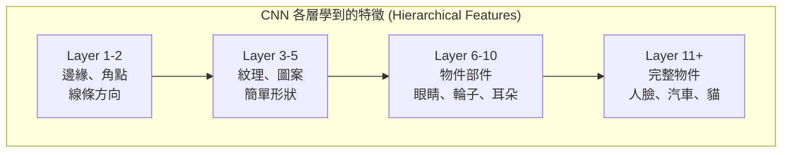

> 直覺類比:就像給模型一堆放大鏡，每個放大鏡專看一種東西。早期層的放大鏡看「邊」、「角」，深層的放大鏡看「眼睛」、「車輪」這種高階概念。

**重要超參數:**

| 參數 | 在做什麼 | 影響 |
|------|---------|------|
| Kernel size | 窗戶多大 | 1×1， 3×3， 5×5， 7×7 都常見;**3×3 是工業界共識** |
| Stride | 一次滑幾格 | stride=2 會讓輸出尺寸減半 |
| Padding | 邊緣補幾圈 0 | padding=1 + kernel=3 + stride=1 → 尺寸不變(`same` padding) |
| Channel / Depth | 用幾個 kernel | 越多抓越多特徵，但參數越多 |

**輸出尺寸公式**(這個一定要記):
```
Output = floor((Input + 2*Padding - Kernel) / Stride) + 1
```

> **常見情境速算**:
> | Input | Kernel | Stride | Padding | Output | 說明 |
> |-------|--------|--------|---------|--------|------|
> | 32 | 3 | 1 | 1 | 32 | same padding，尺寸不變 |
> | 32 | 3 | 2 | 1 | 16 | stride=2，尺寸減半 |
> | 224 | 7 | 2 | 3 | 112 | ResNet 第一層 |
> | 112 | 3 | 2 | 0 | 55 | MaxPool stride=2 (向下取整) |
>
> **記法**: stride=1 + padding=kernel//2 → 尺寸不變。stride=2 → 尺寸大約減半。

**1×1 Conv 為什麼重要?**

看起來 1×1 conv 沒做空間運算，只是逐點相乘，有什麼用?
- **改變 channel 數**(降維/升維):例如把 256 channels 壓到 64 channels 再做 3×3 conv，計算量大幅降低
- **跨 channel 的線性組合**:不同特徵之間做混合
- **加非線性**(後接 ReLU):增加模型表達能力但幾乎不增加參數

這個技巧在 ResNet Bottleneck 跟所有後續架構都用到，要記住。

#### (B) Pooling Layer(池化層)

Pooling 通常用 MaxPool 2×2，做的事情:

```
[1 3 | 2 4]
[2 1 | 0 5]   →   [3 5]
[-----------]      [4 9]
[4 0 | 7 9]
[1 2 | 8 3]
```

三種 pooling:
- **Max Pooling**:取區域內最大值，**最常用**(保留最強特徵)
- **Average Pooling**:取平均，較少用於分類
- **Global Average Pooling (GAP)**:把整張 feature map 縮成一個數字，**取代 FC 層**(ResNet、現代架構都這樣做)

**為什麼要 Pooling?**
1. **降低計算量** — 尺寸減半，後面層的計算就少 4 倍
2. **增加感受野(receptive field)** — 同樣 3×3 的 kernel，在 pooling 後等於看更大範圍
3. **平移不變性(translation invariance)** — 物體稍微移動一點，輸出不會差太多

> 補充:現代很多架構(像 ResNet 後期、YOLO v3 之後、Transformer-based 模型)會用 stride=2 的 conv 取代 pooling，效果差不多但更可學習。Darknet-53 就是純全卷積，完全沒用 pooling。

#### (C) Fully Connected Layer(全連接層)

到了模型最後，通常會把特徵圖攤平接 FC，做最後的分類。

**經典 CNN 的長相(LeNet-5 / AlexNet 風格):**

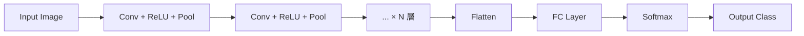

但這個 pattern 在物件偵測(YOLO)裡會被改掉。**現代架構幾乎都用 GAP + 1×1 Conv 取代 FC**，因為 FC 參數太多容易 overfit。

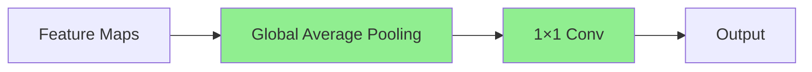
> 上圖:現代架構用 GAP + 1×1 Conv 取代 Flatten + FC，參數量從數百萬降到數千。

### 1.4 常見輔助組件(現代 CNN 的標配)

光有三大核心層還不夠，實務上一定會搭配:

#### Batch Normalization(BN)

對每個 batch 的 activation 做標準化:
```
y = γ * (x - μ_batch) / σ_batch + β
```

其中 γ， β 是可學參數。BN 的好處:
- **加速收斂**(可以用更大 learning rate)
- **穩定訓練**(減少 internal covariate shift)
- **輕微 regularization 效果**(用了 BN 通常可以不用 Dropout)

> **Internal Covariate Shift 是什麼?** 每一層的輸入分布會隨著前面層的參數更新而改變。想像你在學開車，方向盤每次轉的角度跟結果的關係一直在變 — 你就很難學。BN 把每層的輸入標準化到 mean=0, std=1 附近，讓學習更穩定。
>
> **具體例子**: 假設某層的 activation 原本分布在 [100, 200] 之間，BN 後會變成大約 [-1, 1]。γ 和 β 讓模型可以學習「要不要把分布調回原來的範圍」— 如果原本的分布其實很好，模型可以學 γ=50, β=150 把它調回去。

> 注意:BN 在 train 跟 eval 模式行為不同。Train 時用當前 batch 的統計量，eval 時用 running average。**忘記切換 `model.train()` / `model.eval()` 是新手最常見的雷之一。**

#### Activation Function

| 名字 | 公式 | 用在哪 |
|------|------|--------|
| ReLU | max(0， x) | 最經典，YOLOv1~v3 主要用 |
| Leaky ReLU | max(0.01x， x) | 解決 dying ReLU 問題，Darknet 系列愛用 |
| Mish | x * tanh(softplus(x)) | YOLOv4 用，平滑且非單調 |
| SiLU / Swish | x * sigmoid(x) | YOLOv5+ 主要用，效果好 |

> **Dying ReLU 問題**: ReLU 在 x < 0 時輸出恆為 0，梯度也恆為 0。如果某個 neuron 的輸入不幸一直是負數（例如權重更新後 bias 太負），這個 neuron 就「死了」— 永遠輸出 0，永遠沒有梯度，永遠不會恢復。Leaky ReLU 給負半邊一個小斜率（0.01），確保梯度永遠不為零。
>
> **SiLU vs ReLU 差別**: x=5 時 ReLU=5, SiLU=5×σ(5)≈4.97（差不多）。x=-1 時 ReLU=0, SiLU=-1×σ(-1)≈-0.27（SiLU 允許小幅負值通過，且平滑可微）。SiLU 的平滑特性讓梯度更穩定。

#### Dropout

訓練時隨機丟掉一部分 neuron(通常 0.5)，強迫模型學 redundant features，防 overfit。**有 BN 之後，Dropout 在 CNN 裡幾乎不用了。** 但在 FC 層還是有用。

### 1.5 經典 CNN 演進史(快速帶過)

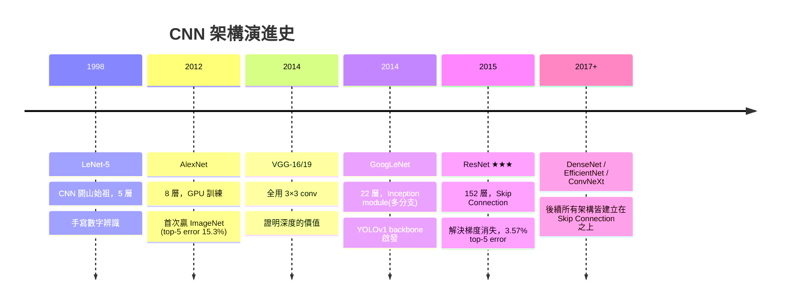

> 重點:**從 ResNet 開始，「深度不再是問題」**，後續所有架構都建立在 Skip Connection 之上(包括 YOLO 系列)。

### Convolution Playground

打開互動網頁的 **「Convolution Playground」** tab:
- 自己拖拉 kernel 的數值，看不同 kernel 對圖片有什麼影響
- 試試 Sobel kernel → 邊緣檢測
- 試試 Gaussian kernel → 模糊
- 試試 Sharpen kernel → 銳化
- 自己亂調 → 看會發生什麼

**重點要他們體會:CNN 的第一層其實就是在做這種事，只是 kernel 是學出來的。早期人類花幾十年研究的 hand-crafted feature(SIFT， HOG， Sobel...)，CNN 訓練幾個 epoch 就能自己長出來。**

---

## 2. 訓練的本質 — 梯度與優化

> 這一章在解一個關鍵問題:**「kernel 的值是學出來的」這句話，到底怎麼學?**
>
> 前面講 CNN 時一直說「這些 filter 是學出來的」、「BN 的 γ 跟 β 是可學參數」，學弟可能心裡都有個黑盒子:**到底什麼叫做「學」?** 這一章就是把那個黑盒子打開。理解這章之後，後面講 ResNet 的「梯度消失」才有意義 — 不然就是名詞解釋而已。

### 2.1 開場問題:模型怎麼變聰明的?

先想一個情境:你寫好了 CNN 架構，初始化權重都是隨機的。

第一次 forward pass，模型輸入一張貓的圖片,輸出「這是飛機」(因為權重隨機,亂猜的)。

問題來了:**那這個模型怎麼從「亂猜」進步到「分得出貓跟狗」?**

答案是兩步:

1. **算出「現在錯多少」** — 這叫 **loss function(損失函數)**
2. **依照錯的方向去調整每一個權重** — 這叫 **梯度下降(gradient descent)**

整個深度學習的訓練,骨子裡就是這兩件事的循環。本章重點是第二步。

### 2.2 梯度到底是什麼

**一句話定義:梯度就是「往哪個方向走,會讓函數值上升最快」。**

想像你站在一座山上,眼睛被矇住。你伸出腳試探周圍,找出「最陡的上坡方向」 — 那個方向,加上「有多陡」這個資訊,就是梯度。

#### 從一維開始:梯度 = 斜率

如果函數只有一個變數,例如 `f(x) = x²`,那梯度就是斜率(也就是導數)。

具體計算:`f'(x) = 2x`
- 在 x = 3 的地方,梯度 = 6 → 往右走會上升,陡度是 6
- 在 x = -2 的地方,梯度 = -4 → 往左走會上升(因為負號代表反向),陡度是 4

這時候梯度是**一個數字**,正負號告訴你方向,大小告訴你陡度。

#### 多維情況:梯度變成向量

事情在多變數時變有趣。假設 `f(x, y) = x² + y²`(這是一個碗形曲面)。

問題來了:**在某一點,「斜率」是多少?**

答案是 — **看你往哪個方向走**。往東走有一個斜率,往北走有另一個,往東北走又是另一個。在三維曲面上,每個方向都有自己的斜率,所以「單一斜率」這個概念失效了。

梯度的工作就是把這些資訊打包起來:

- 它是個**向量**,不是單一數字
- 它的**方向**指向上升最快的那條路
- 它的**長度**就是那個方向上的斜率

**具體例子**:在 `f(x, y) = x² + y²` 的點 (3, 4),梯度是向量 (6, 8):

- 6 = ∂f/∂x = 2×3,代表「往 x 方向的斜率」
- 8 = ∂f/∂y = 2×4,代表「往 y 方向的斜率」
- 整個向量 (6, 8) 指的方向,就是上升最陡的方向
- 那個方向上的斜率是 √(6² + 8²) = 10

#### 對應到神經網路

現在把規模放大。CNN 的「函數」是 loss function,「變數」是模型的所有權重(可能幾百萬到幾百億個)。所以:

> **神經網路的梯度** = 一個跟「全部權重一樣多」的超大向量,告訴你「每個權重要往哪邊調、調多少,才能讓 loss 上升最快」。

我們不要 loss 上升,我們要它**下降**,所以走梯度的反方向 — 這就是梯度下降。

| 比較 | 一個變數 | 多個變數 |
|------|---------|---------|
| 斜率 | 一個數字 | 每個方向都有一個 |
| 梯度 | 一個數字(=斜率) | 一個向量(包含所有方向資訊) |

### 2.3 梯度下降:盲人下山

#### 核心想法

既然梯度告訴我們「上升最快的方向」,那往**反方向**走,就是「下降最快的方向」。重複這個動作,就能慢慢走到函數的最低點(loss 的最低點 = 模型錯最少的權重組合)。

**直覺類比:盲人下山**

你被丟在一座山上,目標是走到山谷最低處,但眼睛被矇住。你能做的就是:

1. 用腳感覺一下「哪個方向最陡」(這就是梯度)
2. 往**相反方向**跨一小步(往下走)
3. 站定,再感覺一次
4. 再走一步
5. 重複,直到周圍變平坦(梯度接近 0),代表你到谷底了

#### 更新公式

```
新權重 = 舊權重 − 學習率 × 梯度
```

這個公式是整個深度學習的心臟,要記住。其中:

- **舊權重**:目前的參數
- **梯度**:loss 對這個權重的偏導數
- **學習率(learning rate, lr)**:一小步有多大,通常 0.1, 0.01, 0.001 之類

#### 具體例子:找 f(x) = x² 的最低點

我們當然知道答案是 x = 0,但假裝不知道,用梯度下降來找。

**準備工作:**
- 函數:`f(x) = x²`
- 梯度(導數):`f'(x) = 2x`
- 起始點:x = 5(隨便挑的)
- 學習率:0.1

**開始走:**

| 步驟 | 當前 x | 當前 f(x) | 梯度 | 新 x |
|------|--------|-----------|------|------|
| 1 | 5.000 | 25.00 | 10.00 | 5 − 0.1×10 = 4.000 |
| 2 | 4.000 | 16.00 | 8.00 | 4 − 0.1×8 = 3.200 |
| 3 | 3.200 | 10.24 | 6.40 | 3.2 − 0.64 = 2.560 |
| 4 | 2.560 | 6.55 | 5.12 | 2.048 |
| 5 | 2.048 | 4.19 | 4.10 | 1.638 |
| ... | ... | ... | ... | ... |
| 20 | ≈0.058 | ≈0.003 | ≈0.116 | ≈0.046 |
| 50 | ≈0 | ≈0 | ≈0 | ≈0 |

**注意一件事:走的步伐越來越小**。因為越接近谷底,梯度(斜率)越小,自動就放慢了。這個「自動煞車」是梯度下降很優雅的地方 — 不需要額外設計。

#### 學習率太大會怎樣?

同樣的例子,把學習率改成 1.1:

| 步驟 | 當前 x | 梯度 | 新 x |
|------|--------|------|------|
| 1 | 5.0 | 10.0 | 5 − 1.1×10 = -6.0 (跳過谷底,飛到對面) |
| 2 | -6.0 | -12.0 | -6 − 1.1×(-12) = 7.2 (又飛回來,而且更遠) |
| 3 | 7.2 | 14.4 | -8.64 |
| 4 | -8.64 | ... | 越走越遠 |

**結果:發散(diverge)**,永遠到不了谷底。這就是為什麼學習率的選擇關鍵 — 太大會發散,太小會慢到天荒地老。

#### 學習率太小會怎樣?

如果學習率設 0.001,從 x=5 出發:

- 第 1 步:x = 5 - 0.001×10 = 4.99
- 第 100 步:x ≈ 4.1
- 第 1000 步:x ≈ 0.7

**訓練要花 10 倍以上時間**才能到達同樣位置。實務上這代表電費跟時間成本爆增。

### 2.4 從一維到神經網路:幾個關鍵差異

剛才的 `f(x) = x²` 只是 toy example,實際訓練 CNN 有幾個關鍵差異:

#### 差異 1:Stochastic Gradient Descent (SGD) — 不要全部資料一起算

理論上,我們應該把整個訓練集(可能幾百萬張圖)都跑一次 forward + backward,得到「真正的」梯度,再走一步。這叫 **Batch Gradient Descent (BGD)**。

問題:
- 100 萬張圖跑一次才走一步,慢到爆
- 整批塞不進 GPU 記憶體

實務上的做法是 **Mini-batch SGD**:

> 每次只用一個小批次(例如 64 張圖)算梯度,就更新權重。這個梯度雖然不準(因為只看了一小部分資料),但**便宜很多**,而且**有點隨機性反而是好事**(後面會講到)。

| 方法 | 每次用多少資料 | 速度 | 梯度品質 |
|------|---------------|------|---------|
| Batch GD | 全部 | 慢 | 準 |
| Stochastic GD | 1 張 | 快但震盪 | 雜訊很多 |
| **Mini-batch SGD** | 32~256 張 | **平衡** | **夠用** |

現代訓練幾乎都是 mini-batch SGD,batch size 常見 32, 64, 128, 256。

#### 差異 2:Backpropagation — 怎麼算出每個權重的梯度

CNN 有幾百萬個權重,梯度怎麼算?

**反向傳播(backpropagation)** 是答案,核心是**鏈式法則(chain rule)**。

直覺:loss 跟「最後一層的權重」的關係很直接,但跟「第一層的權重」的關係要經過好幾層 — 鏈式法則就是把這個「經過好幾層」的影響一層一層展開。

> **不用自己寫**:PyTorch 的 autograd 會自動幫你算。你只要把 forward 寫對,呼叫 `loss.backward()`,所有權重的梯度就算好了。但要理解**它在做什麼** — 不然後面講「梯度消失」會聽不懂。

#### 差異 3:Loss surface 不是漂亮的碗 — 是崎嶇的山地

`f(x) = x²` 是平滑的碗,只有一個最低點。

但神經網路的 loss surface 是**幾百萬維、超級崎嶇的山地**,有:
- 很多**局部最小值(local minima)**:看起來像谷底,其實只是小坑
- **鞍點(saddle point)**:某些方向是谷,某些方向是峰
- **平坦區域**:梯度接近 0,但不是真正的最低點

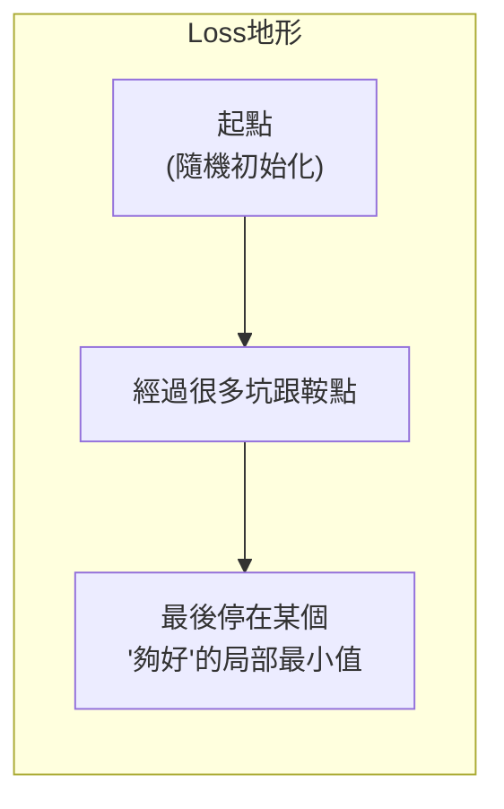

> **重點認知**:訓練神經網路**幾乎不可能**找到全域最小值(global minimum),也**不需要**找到。實務上找到一個夠低的局部最小值,泛化能力就很好。
>
> 有趣的是:**很大的網路反而容易訓練**,因為高維空間中真正的局部最小值很少,大部分看起來像「卡住」的地方其實是鞍點,只要有一點隨機性就能跳出去。SGD 的 mini-batch 雜訊剛好幫了大忙。

### 2.5 進階優化器:不只是純梯度下降

純 SGD 在實務上會遇到很多問題,所以發展出一系列改良版。看名字就好,知道在解什麼問題:

#### Momentum(動量) — 給梯度下降加慣性

問題:SGD 在「狹長山谷」(一個方向陡、一個方向平緩)會來回震盪,進展很慢。

解法:加上「速度」的概念,像滾動的球。

```
速度 = 0.9 × 上一次速度 + 學習率 × 梯度
新權重 = 舊權重 − 速度
```

直覺:如果連續幾步梯度都指向同一方向,速度會累積,走得更快。如果梯度方向忽左忽右,速度會互相抵消,自動穩定。

#### Adam — 工業界最常用

Adam 同時做兩件事:
1. **動量**(累積過去梯度的方向)
2. **自適應學習率**(每個參數有自己的學習率,梯度大的參數用小 lr,梯度小的用大 lr)

**白話**:Adam 是「裝了腦袋的 SGD」,大部分情況下不用調參就能跑得不錯。**這就是為什麼 PyTorch 教學幾乎都用 `optim.Adam`** — 對新手最友善。

#### 學習率排程(Learning Rate Scheduling)

固定的學習率不夠好。實務上會「隨訓練進度調整 lr」:

- **Step decay**:每 30 epoch 把 lr 除以 10
- **Cosine annealing**:lr 像餘弦曲線一樣慢慢降下來
- **Warmup**:訓練初期 lr 從 0 慢慢爬到正常值,避免一開始震盪太大

> **直覺**:訓練早期離谷底還很遠,要大步走;訓練後期接近谷底,要小步精修。**ResNet, YOLO 訓練都會用這套**,後面會看到。

### 2.6 模擬退火 — 走錯路的勇氣

到目前為止講的都是「沿著梯度走」的優化方法。但梯度下降有個致命問題:**它只會往下走,卡在局部最小值就出不來**。

想像一個地形:**有個小山谷在淺處,旁邊有個更深的大山谷**。如果你的起點剛好在小山谷附近,梯度下降會很開心地走到小山谷底部停下來 — 因為周圍都是上坡,梯度告訴它「這裡就是最低點」。

但旁邊還有更深的山谷!梯度下降被卡在 local minimum,看不到 global minimum。

#### 模擬退火的瘋狂想法

**偶爾接受變差的選擇**,這樣才有機會跳出小山谷,去找更深的山谷。

它的靈感來自冶金學的退火(annealing)製程:**打鐵時如果熱鐵突然丟進冷水,金屬內部結構會卡在亂七八糟的高能狀態(脆弱)。但如果慢慢降溫(退火),原子有時間到處挪動、嘗試各種位置,最後會穩定在能量最低的整齊結構(堅固)。**

這個「**高溫時瘋狂亂動,低溫時逐漸穩定**」的想法被搬到優化問題上:

- **高溫**:願意接受很多「變差」的步,大膽探索
- **降溫過程**:越來越挑剔,只接受小幅變差的步
- **低溫**:幾乎只接受變好的步,像梯度下降一樣穩穩走到底

#### 演算法步驟

1. 隨便挑個起點
2. 隨機跳到附近某個點
3. 如果新點比較好 → **直接接受**
4. 如果新點比較差 → **以某個機率接受**(關鍵!)
   - 機率公式:`exp(−Δ / T)`,Δ 是變差多少,T 是當前溫度
   - 溫度高時機率大,什麼爛點都可能接受
   - 溫度低時機率小,只有小幅變差才接受
5. 慢慢降溫
6. 重複,直到溫度趨近於 0

#### 具體例子:會卡住梯度下降的函數

設計一個函數:

```
f(x) = x⁴ − 10x² + 5x
```

這個函數長得像「兩個山谷」:左邊有個**深谷**在 x ≈ −2.4 附近,右邊有個**淺谷**在 x ≈ 2.1 附近。如果起點在 x = 3,梯度下降會直接走進右邊的淺谷,卡死,永遠看不到左邊更深的谷。

**用模擬退火來解(以下是示意,實際有隨機性):**

```
步驟  x      f(x)     溫度    動作
1     3.0    -24      10.0   起點
2     2.7    -36.6    9.5    變好,接受 → 走進右邊淺谷
3     2.1    -41.7    9.0    繼續變好,接受
4     2.5    -38.1    8.6    變差!但溫度高,機率高,接受 → 跳出來!
5     1.4    -25.6    8.1    更差,但機率還行,接受
6     0.2    0.6      7.7    更差,接受 → 跨過中間的山頭了
7    -1.5    -29.8    7.3    變好,接受
8    -2.2    -45.1    6.9    變好,接受 → 進入左邊深谷
9    -2.4    -45.8    6.6    更好
...   (隨著溫度降低,越來越不接受變差的步)
50   -2.42   -45.84   0.6    穩定在左邊深谷的底部 ✓
```

**看到關鍵步驟沒?** 步驟 4-6 是模擬退火的精髓:它**接受了好幾次「變差」的選擇**,才有機會翻越中間的山頭,走到真正最深的山谷。換成梯度下降,絕對卡在右邊的淺谷出不來。

#### 跟梯度下降的對比

| | 梯度下降 | 模擬退火 |
|---|---------|---------|
| 怎麼走 | 沿梯度方向 | 隨機跳 |
| 要算梯度? | 要 | **不用!**只要能算 f(x) 就行 |
| 接受變差? | 絕對不要 | **高溫時願意** |
| 會卡 local minimum? | 容易卡 | 比較不容易 |
| 速度 | 快 | 慢 |
| 適合什麼? | 平滑、可微分的函數 | 崎嶇、離散、無法算梯度的問題 |

#### 用在哪些地方?

模擬退火特別擅長**梯度下降做不了的事**:

- **旅行推銷員問題(TSP)**:找最短路線經過所有城市。完全沒有梯度可言,但模擬退火很好用 — 隨機交換兩個城市的順序就是一次「跳」
- **晶片設計**:把元件擺在晶片上的最佳位置
- **排班、排課**:一堆離散的限制,沒有梯度
- **神經網路超參數搜尋**:learning rate, 層數這些不能微分的東西

#### 跟深度學習有什麼關係?

模擬退火本身**不會直接拿來訓練神經網路**(因為梯度太好用了不用白不用),但它的精神 — **「適度的隨機性能幫助跳出局部最小值」** — 已經滲透進現代深度學習:

| 技巧 | 跟模擬退火的精神對應 |
|------|---------------------|
| **Mini-batch SGD** | 小 batch 的梯度雜訊,等於每步都有點隨機 → 自然跳出鞍點/局部最小 |
| **Dropout** | 隨機丟掉 neuron,強迫模型探索不同路徑 |
| **Learning rate scheduling** | 早期大 lr 像「高溫」(大膽探索),後期小 lr 像「低溫」(精修) |
| **Mosaic / MixUp** (YOLOv4 用) | 資料隨機混合,等於 loss landscape 持續變動,不容易卡死 |
| **Stochastic Weight Averaging** | 訓練後期取多個權重的平均,減少落在尖銳 local minimum |

> **一句話總結**:梯度下降是「直線思考的優化」,模擬退火是「接受隨機性的優化」。**現代深度學習的訓練,某種程度是兩者的混血** — 用梯度當主要方向,但加入隨機性來避免卡住。

### 2.7 串起來:CNN 是怎麼變聰明的

回到本章開場的問題。完整流程:

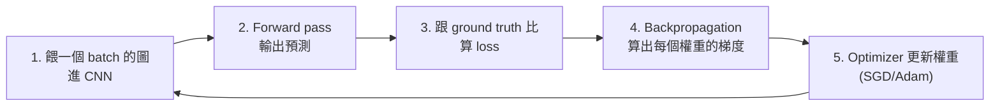

這個循環跑幾百萬次,模型就慢慢變聰明。

**關鍵理解:**
- CNN 的「每一個 kernel 數值」、「BN 的 γ β」、「FC 層的權重」全部都是用這個流程學出來的
- 訓練完成的標誌是 **loss 不再下降**(梯度接近 0,走不動了)
- 「訓練要多久」= 「這個循環要跑多少次」

### Gradient Descent Playground

打開互動網頁的 **「Gradient Descent Playground」** tab:
- 自己選函數(平滑的 x²、崎嶇的多谷函數、有鞍點的函數)
- 拖拉學習率 slider,看不同 lr 的效果(太大發散、太小慢、剛好)
- 切換 SGD / SGD+Momentum / Adam,看走的路徑差異
- 開「模擬退火模式」,看怎麼跳出局部最小值
- 重點要學弟體會:**learning rate 跟 optimizer 的選擇,真的會影響到能不能訓練起來**

> **這一章看完,他們應該能回答**:
> 1. 為什麼學習率太大不好、太小也不好?
> 2. 為什麼 mini-batch 比一次塞全部資料好?
> 3. 為什麼有時候模型會卡住不再進步?
> 4. SGD 跟 Adam 差在哪?
> 5. 為什麼訓練 loop 要 `optimizer.zero_grad()` → `backward()` → `step()` 這個順序?

---

## 3. ResNet 全變體

### 3.1 為什麼需要 ResNet

ResNet 由微軟研究院的 Kaiming He(何愷明)等人在 2015 年提出,論文叫《Deep Residual Learning for Image Recognition》。**152 層的網路在 ILSVRC 2015 拿下 3.57% top-5 error**,比 VGG 深 8 倍但運算複雜度更低。

**這篇論文是 deep learning 史上引用最多的論文之一**,後續所有現代架構幾乎都用了 skip connection,包括 Transformer、YOLO 系列、Diffusion Model。

### 3.2 網路越深一定越好嗎

2014 年大家發現一個怪現象:**把 CNN 疊得很深,訓練 loss 居然變高**(不是 overfitting,是 train loss 就高)。

這違反直覺,理論上深層網路至少應該跟淺層一樣好(深層的可以把多出來的層學成 identity mapping)。但實務上做不到。

```
20 層的 CNN  →  train error: 5%
56 層的 CNN  →  train error: 11%   (蛤?)
```

這個問題叫做 **degradation problem**,**不是過擬合(因為 train error 也變高)**,是優化問題 — 我們無法把那麼深的網路訓練起來。

### 3.3 兇手 - 梯度消失(Gradient Vanishing)

> **接續第 2 章**:現在我們知道訓練靠的是 backpropagation 把梯度一層層傳回去更新權重。問題是 — 梯度在往回傳的過程中會「衰減」。

回想 backprop 的鏈式法則,梯度從輸出層往輸入層傳的時候,**每經過一層就乘一次該層的偏導數**。

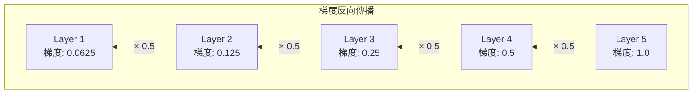

如果每層的梯度都小於 1(例如 0.5),那:
- 10 層後:0.5^10 ≈ 0.001
- 50 層後:0.5^50 ≈ 10^(-15) → 等於 0

**結果:前面的層根本收不到梯度,等於沒在學**(回去看第 2 章的更新公式:梯度 = 0,新權重 ≈ 舊權重,完全沒更新)。

#### 反過來的災難:梯度爆炸(Gradient Explosion)

跟梯度消失對稱,如果每層的梯度都大於 1(例如 1.5):
- 10 層後:1.5^10 ≈ 58
- 50 層後:1.5^50 ≈ 6 億
- 100 層後:天文數字

**結果:**
- 參數更新瘋狂亂跳(回去看公式:`新權重 = 舊權重 − 學習率 × 梯度`,梯度變成 10⁹,參數一步飛到外太空)
- Loss 變成 NaN(數值大到電腦表示不了)
- 訓練曲線:loss 原本好好下降,**突然往上飆,然後變 NaN**

#### 兩個極端的對照

| | 梯度爆炸 | 梯度消失 |
|---|---------|---------|
| 梯度大小 | 大到天上去(10⁹、∞、NaN) | 小到接近 0 |
| 參數更新 | 一步飛走,亂跳 | 幾乎不動,學不到東西 |
| 訓練現象 | loss 突然飆高、變 NaN | loss 不太下降,卡住 |
| 誰受害 | 全部層都亂掉 | **前面幾層最慘**,後面層還能學 |
| 常見場景 | 深層網路、RNN、權重初始太大 | Sigmoid/Tanh 激活、深層網路、權重初始太小 |

> **直覺記法**:梯度太高會炸,太低會死,訓練深度網路的藝術就是把它穩穩控制在中間。深度學習過去十幾年的進步,有很大一部分就是在解這件事。

#### 經典的解法(全方位防護)

| 方法 | 在做什麼 | 對付誰 |
|------|---------|--------|
| **梯度裁剪(Gradient Clipping)** | 設上限例如 5,梯度超過就壓回去 | 主要對付爆炸,RNN/LSTM 必用 |
| **好的權重初始化(He/Xavier)** | 根據每層 neuron 數量算合適的初始範圍 | 兩個都對付 |
| **Batch Normalization** | 每層強制標準化,雙向防護 | 兩個都對付 |
| **ReLU 激活函數** | 正半邊導數恆為 1,不會把梯度壓小 | 主要對付消失 |
| **Residual Connection (ResNet)** | 給梯度開一條捷徑 | **兩個都對付,最有效** ★ |
| 降低學習率 | 直接讓步伐變小 | 對付爆炸,治標 |

> 直覺類比:從一樓傳話到 50 樓,每傳一層走音 50%,到頂樓已經完全聽不懂。ResNet 的 skip connection 就像給每一樓裝一支直通電話 — 訊息可以直接跳過中間樓層。

### 3.4 ResNet 的解法 - 殘差學習(Residual Learning)

何愷明的核心想法:**讓網路學的不是直接的映射 H(x),而是殘差 F(x) = H(x) - x**。

```
y = F(x) + x
```

換句話說,模型只要學「我要在 x 上加什麼東西」,而不是「我要產出什麼」。當這一塊真的沒用,模型可以把 F(x) 學成 0,等於 identity mapping,不會比原本差。

**架構上長這樣:**

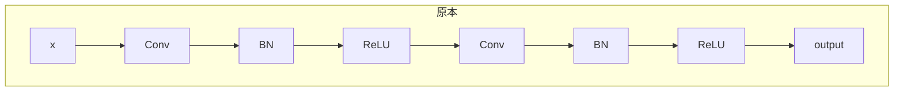

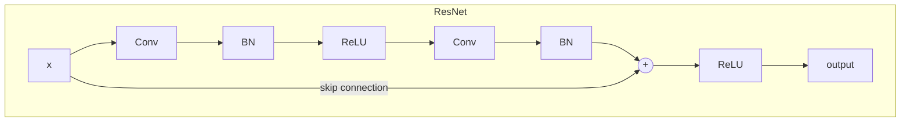

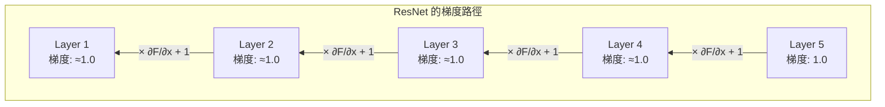

> **關鍵差異**: 普通 CNN 的梯度是連乘(越乘越小),ResNet 因為 skip connection 讓梯度有加法項(+1),所以不管多深都不會消失。

**為什麼這樣有用?(三個視角)**

1. **梯度直接通路** — backward 時梯度可以直接從後面層流到前面層,不會被中間層稀釋(因為 ∂(F+x)/∂x = ∂F/∂x + 1,那個 +1 保證梯度永遠有東西)
2. **學殘差比學整體容易** — 模型只要學差量,起點已經很近
3. **退化解(degradation solution)** — 如果這一塊沒用,F(x) 學成 0 就好,不會劣化

### 3.5 兩種殘差區塊

ResNet 有兩種 building block,看模型大小決定用哪一種:

#### Basic Block(用於 ResNet-18， ResNet-34)

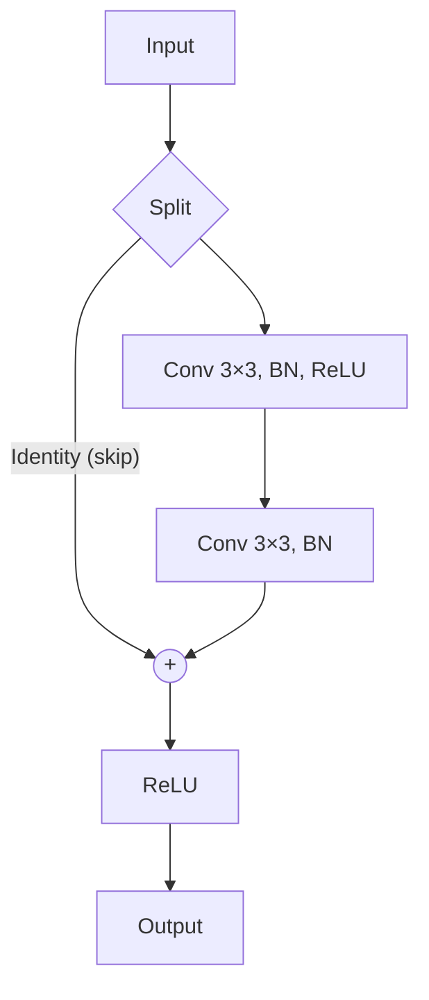

- 兩層 3×3 conv
- 速度快、計算便宜
- 適合小模型

#### Bottleneck Block(用於 ResNet-50， 101， 152)

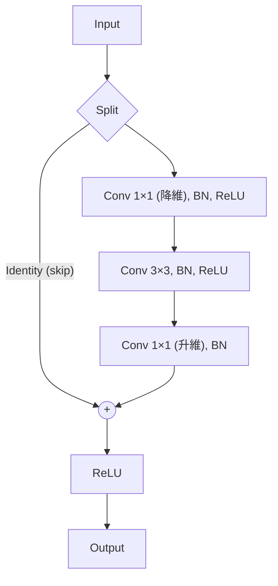

- 三層 conv:1×1 降維 → 3×3 計算 → 1×1 升維
- **省參數**:相較於兩層 3×3 64 + 3×3 256，參數從 294，912 降到 69，632
- 更多 conv 引入更多非線性，容量更大

**具體數字範例（以 256-channel 輸入為例）:**

| 方案 | 層配置 | 參數量計算 | 總參數 |
|------|--------|-----------|--------|
| 兩層 3×3 | 3×3×256×256 × 2 | 256×256×9 × 2 | 1,179,648 |
| Bottleneck | 1×1×256×64 + 3×3×64×64 + 1×1×64×256 | 16,384 + 36,864 + 16,384 | 69,632 |

> **省了 17 倍的參數!** Bottleneck 的精神:**讓貴的運算(3×3 conv)在比較少的 channel 上做**。這個技巧後續所有架構都沿用,YOLO 也是。

### 3.6 完整層配置(Stage 設計)

ResNet 由 5 個階段組成,所有變體都遵循這個結構:

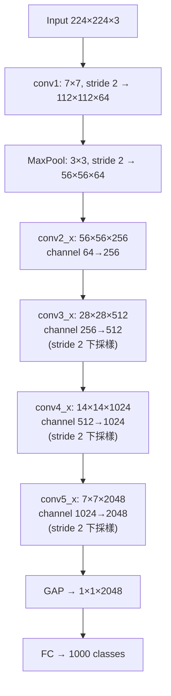

> **資訊守恆原則**: 注意每個 stage 空間尺寸減半（÷2），但 channel 數翻倍（×2）。所以每層的「總資訊量」= 寬 × 高 × channel 大致不變（56×56×64 ≈ 28×28×128 ≈ 200K）。這是一個重要的設計哲學。

| Stage | Output | ResNet-18 | ResNet-34 | ResNet-50 | ResNet-101 | ResNet-152 |
|-------|--------|-----------|-----------|-----------|------------|------------|
| conv1 | 112×112 | 7×7， 64， stride 2 | ← | ← | ← | ← |
| | 56×56 | 3×3 maxpool， stride 2 | ← | ← | ← | ← |
| conv2_x | 56×56 | BasicBlock × 2 | BasicBlock × 3 | Bottleneck × 3 | × 3 | × 3 |
| conv3_x | 28×28 | × 2 | × 4 | × 4 | × 4 | × 8 |
| conv4_x | 14×14 | × 2 | × 6 | × 6 | × 23 | × 36 |
| conv5_x | 7×7 | × 2 | × 3 | × 3 | × 3 | × 3 |
| | 1×1 | GAP， 1000-d FC， Softmax | ← | ← | ← | ← |
| **FLOPs** | | 1.8G | 3.6G | 3.8G | 7.6G | 11.3G |

**幾個觀察重點:**
- 每個 stage 的 channel 數翻倍(64→128→256→512),空間尺寸減半 → **資訊量大致守恆**
- 用 GAP 取代 FC,大幅減少參數量
- 整個架構非常規律,**後面所有 backbone 設計都沿用這個 pattern**(包括 Darknet-53、CSPDarknet)

### 3.7 下採樣機制 - Downsampling

在 conv3_x、conv4_x、conv5_x 的**第一個** residual block,第一個 3×3 conv 用 stride=2 來下採樣。但這時候 input 跟 output 的 channel/spatial 不匹配,沒辦法直接相加,所以 shortcut 也要對應調整 — **用 1×1 stride=2 的 conv 做 projection**(這叫 projection shortcut)。

```python
if stride != 1 or in_channels != out_channels:
    self.shortcut = nn.Sequential(
        nn.Conv2d(in_channels， out_channels， 1， stride)，
        nn.BatchNorm2d(out_channels)
    )
else:
    self.shortcut = nn.Identity()  # 直接用 x
```

### 3.8 Pre-activation ResNet(ResNet v2)

何愷明在 2016 年又發了一篇《Identity Mappings in Deep Residual Networks》,提出 **pre-activation** 設計。

把 BN， ReLU 從 conv 之後移到 conv 之前:

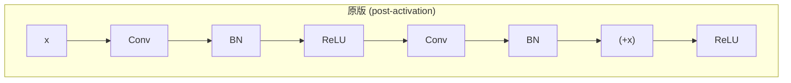

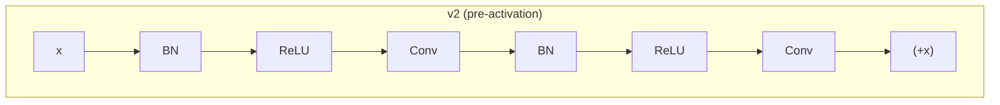

**為什麼這樣更好?**
- 原版:shortcut 加完還要過 ReLU,**梯度路徑被破壞**(ReLU 的負半邊梯度為 0)
- v2:shortcut 是純 identity,**梯度直接無損傳遞**

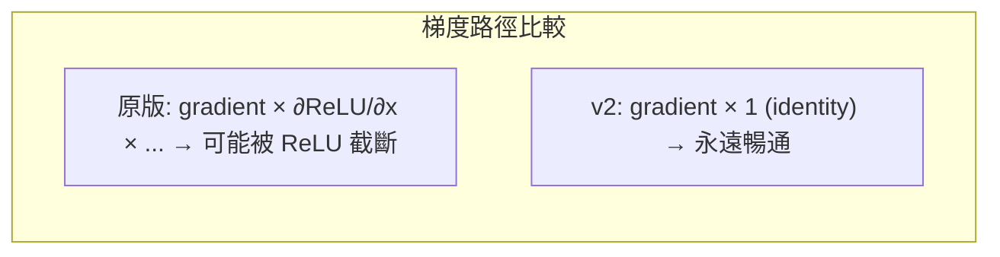

結果:**可以訓練到 1000+ 層**(原版到 200 層就開始劣化)。

### 3.9 訓練細節

- 輸入 224×224,per-pixel mean subtraction
- SGD with momentum 0.9,weight decay 1e-4
- Learning rate 從 0.1 開始,error plateau 時除以 10
- Batch size 256
- **沒有用 Dropout**(用 BN 取代)

> **回顧第 2 章**:這裡的 "SGD with momentum"、"lr 從 0.1 開始,plateau 時除以 10" 就是我們講過的 SGD+Momentum 跟 Step decay scheduling。看到了吧,**第 2 章不是純理論**,實際訓練 ResNet/YOLO 都會用到。

### Gradient Vanishing

打開互動網頁的 **「Gradient Vanishing Demo」** tab:
- 一邊是普通 CNN，一邊是 ResNet
- 拖動「層數」slider，從 5 層拉到 60 層
- 看每一層的梯度大小視覺化(顏色從亮 → 暗代表梯度從大 → 小)
- 學弟會直接看到普通 CNN 在 30 層後梯度全黑，ResNet 還是亮的

---

## 4. YOLO 系列演進

### 4.1 物件偵測 vs 分類

先區分清楚兩件事:

| 任務 | 輸入 | 輸出 |
|------|------|------|
| 分類(Classification) | 一張圖 | 這張圖是什麼類別 |
| 偵測(Detection) | 一張圖 | 圖裡有哪些物件 + 它們在哪(bounding box)+ 各自是什麼類別 |

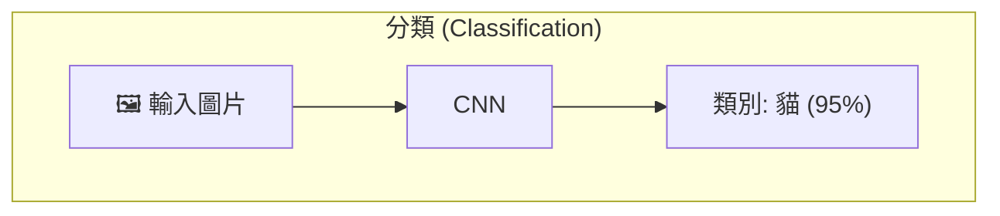

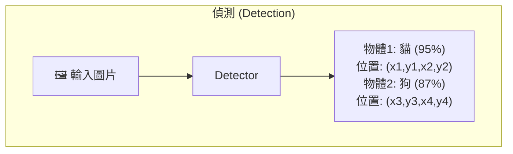

偵測比分類難很多，因為要同時回答 **「在哪」** 和 **「是什麼」**，而且物體數量不固定（一張圖可能 0 個物體，也可能 100 個）。

### 4.2 在 YOLO 之前 - Two-stage Detector

YOLO 出現之前，主流是 R-CNN 系列(R-CNN → Fast R-CNN → Faster R-CNN)，做法是:

1. **第一階段** — 用 region proposal 找出可能有物體的區域
2. **第二階段** — 對每個區域做分類

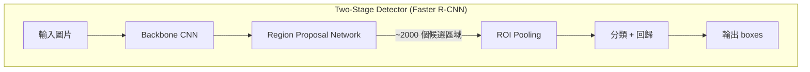

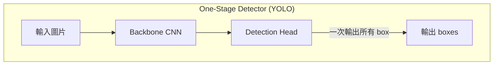

**問題:慢**。Faster R-CNN 在 2015 年大概 5~7 FPS，沒辦法即時。YOLO 則能達到 45 FPS（YOLOv1）甚至更高。

> **FPS (Frames Per Second)** 即時偵測通常要求 ≥ 30 FPS，意味著模型必須在 33ms 內完成整張圖的推論。

### 4.3 YOLOv1(2016) - One-stage 開山之作

> 論文:*You Only Look Once: Unified， Real-Time Object Detection* (Redmon et al.， 2016)
> 關鍵字:**單階段、grid prediction、real-time**

#### 核心思想

把偵測當成一個 regression 問題，**一次到底**。

#### 架構 - GoogLeNet 啟發版

- **輸入**:448×448×3
- **24 層卷積 + 2 層 FC**
- 卷積層交替使用 1×1(降維)+ 3×3
- 啟發自 GoogLeNet，但用 1×1 reduction + 3×3 取代 Inception module

```mermaid
flowchart TD
    A["Input (448×448×3)"] --> B["24 層 Conv (1×1 + 3×3 交替)"]
    B --> C["2 層 FC (4096 → 1470)"]
    C --> D["Reshape → 7×7×30 tensor"]
    
    D --> E["每個 cell 預測:"]
    E --> F["2 個 bounding box (x,y,w,h,conf) × 2 = 10 值"]
    E --> G["20 個類別機率"]
```

#### 輸出設計 - S × S × (B × 5 + C)

- **S = 7**:網格大小 7×7
- **B = 2**:每個 grid cell 預測 2 個 bounding box
- **C = 20**:PASCAL VOC 20 類
- 每個 box 預測 (x， y， w， h， confidence)

**最終輸出 tensor**:7 × 7 × (2×5 + 20) = **7 × 7 × 30**

> **具體例子**: 假設圖片上有一隻狗，狗的中心點落在第 (3, 4) 個 grid cell。那麼：
> - 只有 cell (3, 4) 「負責」預測這隻狗
> - 這個 cell 輸出 30 個數字：前 5 個是第一個 box 的 (x, y, w, h, conf)，接下來 5 個是第二個 box，最後 20 個是 20 類的機率
> - x, y 是相對於 cell 左上角的偏移（0~1 之間）
> - w, h 是相對於整張圖的比例（0~1 之間）
> - confidence = P(物體存在) × IoU(預測box, GT box)
>
> **限制**: 每個 cell 只能預測「一個類別」（20 個類別機率是 cell 共享的，不是每個 box 各一組）。所以如果兩個不同類別的物體中心點落在同一個 cell → 只能偵測到一個。

#### Loss 函數 - Multi-part Sum-Squared Error

```mermaid
flowchart TD
    Loss["Total Loss"] --> A["λ_coord × 定位誤差<br/>(x, y, √w, √h)<br/>權重: 5"]
    Loss --> B["含物件 box 的<br/>Confidence Error<br/>權重: 1"]
    Loss --> C["λ_noobj × 不含物件 box 的<br/>Confidence Error<br/>權重: 0.5"]
    Loss --> D["含物件 cell 的<br/>分類誤差<br/>權重: 1"]
    
    style A fill:#FF6B6B
    style B fill:#4ECDC4
    style C fill:#95E1D3
    style D fill:#F38181
```

```
Loss = λ_coord × Σ (定位誤差: x， y， w， h)
     + Σ (含物件 box 的 confidence error)
     + λ_noobj × Σ (不含物件 box 的 confidence error)
     + Σ (含物件 cell 的分類誤差)
```

- **λ_coord = 5**(強化定位的重要性)
- **λ_noobj = 0.5**(弱化大量背景的影響，因為 7×7 大部分格子都沒物體)
- 寬高用 √w， √h(解決大小框誤差不對稱問題 — 大框差 5 pixel 不嚴重，小框差 5 pixel 很慘)

> **為什麼用 √w, √h?** 假設 GT 寬度是 100 pixel，預測 95 pixel → 差 5%，可接受。但如果 GT 寬度是 10 pixel，預測 5 pixel → 差 50%，很嚴重。用平方根後:√100=10, √95≈9.75（差 0.25）vs √10≈3.16, √5≈2.24（差 0.92）。平方根讓小物體的誤差被放大，大物體的誤差被壓縮，更符合直覺。

#### 限制 - 後續版本要解決的

- 每個 cell 只能預測一類 → **群體小物件偵測差**
- 沒有 anchor box，定位粗
- 對奇怪比例物件泛化差
- 用 FC 層，參數多

### 4.4 YOLOv2 / YOLO9000(2016/2017)

> 論文:*YOLO9000: Better， Faster， Stronger*
> 關鍵字:**Anchor box、Batch Norm、Multi-scale training**

#### Backbone:Darknet-19

- 19 層卷積 + 5 層 max pooling
- 主要用 3×3 + 1×1 卷積
- 每層後加 BN
- ImageNet 上 72.9% top-1 / 91.2% top-5

#### 七大改進

| 改進 | 內容 | 效果 |
|------|------|------|
| 1. Batch Normalization | 所有 conv 後加 BN，移除 dropout | mAP +2% |
| 2. High Resolution Classifier | 用 448×448 fine-tune 分類器 10 epoch | mAP +4% |
| 3. **Anchor Boxes** | 移除 FC，改用 anchor。輸入改 416×416 | recall ↑ |
| 4. Dimension Clusters | k-means(IoU 距離)在訓練集找 anchor | 比手選好 |
| 5. Direct Location Prediction | sigmoid 限制中心在 cell 內 | 訓練穩定 |
| 6. Fine-Grained Features | passthrough layer 接 26×26 → 13×13 | 小物件 |
| 7. Multi-Scale Training | 每 10 batches 換尺寸{320， 352， ...， 608} | 多解析度泛化 |

#### Anchor 是什麼?

想像你預先定義好幾個常見的 box 形狀(瘦高、寬扁、正方形...)，每個格子上都「掛」這些 anchor，**模型只要預測「目標 box 相對於 anchor 的調整量」**，而不是直接預測絕對座標。

**直覺類比**: 就像給你一張空白問卷跟給你一張填好 80% 的草稿 — 後者你只要修改錯的地方就好，不用從頭寫。Anchor 就是那個「80% 正確的草稿」。

```mermaid
flowchart TD
    subgraph "Anchor-Based 預測流程"
        A["原始圖片 416×416"] --> B["切成 13×13 grid"]
        B --> C["每個格子掛 3 個 anchor"]
        C --> D["模型預測每個 anchor 的偏移量<br/>(tx, ty, tw, th)"]
        D --> E["解碼成最終 bbox"]
    end
```

**具體例子**: 假設某格子的左上角座標是 (5, 3)，掛了一個 anchor 寬高是 (116, 90)：

```
bx = σ(tx) + cx       # 中心 x = sigmoid(預測量) + 格子 x 座標
by = σ(ty) + cy       # 中心 y 同理
bw = pw × e^(tw)      # 寬度 = anchor 寬 × e^(預測量)
bh = ph × e^(th)      # 高度 = anchor 高 × e^(預測量)
```

> **為什麼用 sigmoid 限制中心?** sigmoid 輸出 (0,1)，確保預測的中心點永遠落在當前 cell 內部，不會「跑到隔壁 cell 去」。這讓訓練更穩定。
>
> **為什麼寬高用 e^(tw)?** 因為寬高不能是負數，e^x 永遠為正；而且 e^0 = 1 代表不調整，e 的正負值代表放大/縮小，很直覺。

這樣比直接預測 (x， y， w， h) 容易學很多，因為**起點已經很接近答案了**。模型只要預測「微調」，不用從零開始。

#### YOLO9000 的特殊貢獻

用 WordTree 整合 ImageNet(分類資料)+ COCO(偵測資料)，可偵測 9000+ 類別，即使該類別沒有偵測標註。

### 4.5 YOLOv3(2018) - Multi-scale Prediction

> 論文:*YOLOv3: An Incremental Improvement*
> 關鍵字:**Darknet-53、三尺度預測、FPN-like**

#### Backbone - Darknet-53

- **53 層 conv**，加入 ResNet 的 skip connection
- **完全沒有 pooling**，用 stride=2 conv 取代
- top-1 / top-5 與 ResNet-152 相當，**速度快兩倍**

```
Layer Type     Filters   Size     Output
Conv           32        3×3      256×256
Conv           64        3×3/2    128×128
[1× Residual]
  Conv         32        1×1
  Conv         64        3×3
Conv           128       3×3/2    64×64
[2× Residual]
Conv           256       3×3/2    32×32
[8× Residual]      ← 輸出至 detection scale 3 (52×52)
Conv           512       3×3/2    16×16
[8× Residual]      ← 輸出至 detection scale 2 (26×26)
Conv           1024      3×3/2    8×8
[4× Residual]      ← 輸出至 detection scale 1 (13×13)
```

#### 多尺度預測 - 類 FPN
> FPN, Feature Pyramid Network 特徵金字塔網路
>
> **FPN 核心想法**: CNN 自然會產生多尺度的 feature map — 淺層的 feature map 解析度高（保留細節、位置精確），深層的 feature map 解析度低但語意豐富（知道「這是什麼」）。FPN 的做法是把深層的語意資訊 top-down 傳遞到淺層，讓淺層同時擁有「高解析度」和「高語意」。


YOLOv3 在**三個不同尺度**的 feature map 上預測，這個設計影響了後面所有 YOLO 版本:

```mermaid
flowchart TD
    A["Input 416×416"] --> B[Darknet-53]
    B --> C["13×13 feature map (stride 32)"]
    B --> D["26×26 feature map (stride 16)"]
    B --> E["52×52 feature map (stride 8)"]
    
    C --> |"大 receptive field"| F["預測大物體<br/>(如: 車、公車)"]
    D --> |"中 receptive field"| G["預測中物體<br/>(如: 人、狗)"]
    E --> |"小 receptive field"| H["預測小物體<br/>(如: 杯子、遙控器)"]
    
    C --> |"上採樣 + concat"| D
    D --> |"上採樣 + concat"| E
```

> **為什麼多尺度很重要?** 大物體在 feature map 上佔很多格子，用小 feature map (13×13) 預測就夠；小物體在 feature map 上可能只佔一兩格，需要大 feature map (52×52) 才有足夠解析度去偵測。這就是 FPN (Feature Pyramid Network) 的核心想法。

#### Anchor 設定

每個尺度用 3 個 anchor，共 9 個(k-means 在 COCO 上得到):
- **13×13(大物體)**:(116×90)， (156×198)， (373×326)
- **26×26(中物體)**:(30×61)， (62×45)， (59×119)
- **52×52(小物體)**:(10×13)， (16×30)， (33×23)

#### 輸出張量

每個 scale 輸出 `S × S × [3 × (4 + 1 + 80)]` = `S × S × 255`(COCO 80 類)

#### 分類改變 - Multi-label

YOLOv3 用 **sigmoid + binary cross-entropy 取代 softmax**，因為:
- 一個物體可能屬於多個類別(例如 Woman + Person 都對)
- COCO 的 label 不是互斥的
- BCE 訓練更穩定

### 4.6 YOLOv4(2020) - 工程集大成

> 論文:*YOLOv4: Optimal Speed and Accuracy of Object Detection* (Bochkovskiy， Wang， Liao)
> 關鍵字:**Backbone+Neck+Head、Bag of Freebies、Bag of Specials**

#### 三段式架構 - YOLO 系列首次明確採用

```mermaid
flowchart LR
    A[Input Image] --> B["Backbone<br/>(CSPDarknet53)<br/>提取特徵"]
    B --> C["Neck<br/>(SPP + PANet)<br/>特徵融合"]
    C --> D["Head<br/>(YOLOv3 head)<br/>偵測輸出"]
```

**從 v4 開始，所有 YOLO 都長這樣**，不只 YOLO，幾乎所有現代 detector 都是這個結構。

| 組件 | 功能 | 類比 |
|------|------|------|
| **Backbone** | 從原始圖片中提取多層次特徵 | 相當於「眼睛看到什麼」 |
| **Neck** | 把不同層次的特徵融合在一起 | 相當於「把看到的東西綜合判斷」 |
| **Head** | 根據融合的特徵做最終預測 | 相當於「做出最終決定」 |

#### Backbone - CSPDarknet-53

在 Darknet-53 加入 **CSPNet (Cross Stage Partial Network)**:
- 把 base layer 的 feature map **切成兩半**
- 一半進 dense block，一半 shortcut
- 最後 concat

```mermaid
flowchart TD
    A[Input Feature Map] --> B["Split (切成兩半)"]
    B --> |"Part 1 (50%)"| C["Dense Block<br/>(多層 Conv)"]
    B --> |"Part 2 (50%)"| D["直接 Shortcut<br/>(不做運算)"]
    C --> E[Concat]
    D --> E
    E --> F[Transition Layer]
    F --> G[Output]
```

> **為什麼要切一半?** DenseNet 的問題是每一層都跟前面所有層 concat，梯度資訊會被大量重複計算。CSP 把 feature 切一半，只讓一半去做 dense 運算，另一半直接跳過 — 減少了約 20% 計算量，同時保留了 DenseNet 的梯度流動優勢。

效果:減少計算、提升梯度流，**梯度不會在重複的 dense block 中重複計算**。

激活函數從 Leaky ReLU 換成 **Mish**:`x * tanh(softplus(x))`，平滑且非單調。

#### Neck - SPP + PANet

**SPP (Spatial Pyramid Pooling)**:多尺度 max pool(5×5， 9×9， 13×13)concat，擴大 receptive field 但不增加計算量。

> **SPP 具體做法**: 對同一張 feature map 同時做三種不同大小的 MaxPool（padding 讓輸出尺寸不變），然後把三個結果跟原始 feature map concat 在一起。效果等同用很大的 kernel 去看，但計算量遠小於真的用大 kernel conv。
>
> ```
> 輸入 Feature Map (13×13×512)
>   ├─→ MaxPool 5×5  → (13×13×512)
>   ├─→ MaxPool 9×9  → (13×13×512)
>   ├─→ MaxPool 13×13 → (13×13×512)
>   └─→ Identity     → (13×13×512)
>   → Concat → (13×13×2048)
> ```

**PANet (Path Aggregation Network)**:FPN 是 top-down(深層特徵往上傳到淺層)，PANet 多加一條 **bottom-up**(淺層特徵也傳到深層)，雙向強化。

```mermaid
flowchart LR
    subgraph FPN["Top-down (FPN)"]
        direction TB
        P5[P5 深層/語意強] --> |upsample + concat| P4[P4]
        P4 --> |upsample + concat| P3[P3 淺層/細節多]
    end
    
    subgraph PAN["Bottom-up (PANet 加的)"]
        direction TB
        P3_2[P3'] --> |downsample + concat| P4_2[P4']
        P4_2 --> |downsample + concat| P5_2[P5']
    end
    
    FPN --> PAN
```

> **為什麼需要雙向?** FPN 只有 top-down，深層語意資訊傳到淺層需要經過很多層才到 — 路徑太長，資訊損失大。PANet 加上 bottom-up 路徑後，淺層的精確定位資訊也能快速傳到深層，兩邊都受益。

#### Head - 沿用 YOLOv3 head(anchor-based， 3 scales)

#### Bag of Freebies (BoF) — 不增加推論成本

只在訓練時用，推論不影響速度:
- **Mosaic data augmentation**(4 張圖拼一張，讓模型一次看到很多 context)

> **Mosaic 具體做法**: 隨機取 4 張訓練圖片，分別隨機裁切，拼成一張 2×2 的大圖。好處有三：(1) 一個 batch 等於看了 4 倍的圖片，BN 統計量更準 (2) 圖片邊緣自然產生了各種縮小的物體，等同小物體增強 (3) 背景更多樣化。
>
> **連結到第 2 章**: 注意 Mosaic 引入了大量隨機性,等於每個 batch 看到的「資料」都不一樣 — 這就是我們在模擬退火段落講到的「適度隨機性能幫助跳出局部最小值」的精神。

- **CutMix**

> **CutMix 具體做法**: 從圖 A 中切出一個矩形區塊，貼到圖 B 上，label 按面積比例混合。例如切了 30% 面積的 cat 貼到 dog 圖上，label 就變成 0.3×cat + 0.7×dog。

- **Class label smoothing**(讓 one-hot 變成 0.9/0.1，避免過度自信)

> **Label Smoothing 例子**: 原本 3 類的 one-hot label [0, 1, 0] 變成 [0.033, 0.933, 0.033]。公式是 y_smooth = y × (1 - ε) + ε/K，其中 ε=0.1, K=類別數。這避免模型對自己的預測過度自信，提升泛化能力。

- **DropBlock regularization**(整塊整塊地 dropout)

> **為什麼不用普通 Dropout?** 在 CNN 裡，相鄰的 activation 是高度相關的。隨機 drop 個別 pixel，旁邊的 pixel 仍然攜帶幾乎相同的資訊 — dropout 等於沒效果。DropBlock 直接丟掉一個連續的矩形區域，強迫模型不能依賴任何局部區域。

- **CIoU Loss** 取代 MSE — 同時考慮 overlap、中心距離、長寬比

> **IoU 家族 Loss 詳解:**
>
> **IoU (Intersection over Union)** 是衡量兩個 box 重疊程度的指標:
> ```
> IoU = (兩 box 交集面積) / (兩 box 聯集面積)
> ```
> IoU = 1 代表完美重合，IoU = 0 代表完全沒交集。
>
> **問題**:如果兩個 box 完全沒交集，IoU = 0 — 梯度為 0，模型不知道怎麼調。
>
> **GIoU (Generalized IoU)**:加上一個懲罰項考慮「離交集有多遠」
> ```
> GIoU = IoU - (最小包圍框面積 - 聯集面積) / 最小包圍框面積
> ```
>
> **DIoU (Distance IoU)**:考慮兩 box 中心點距離
> ```
> DIoU = IoU - (中心距離²) / (最小包圍框對角線²)
> ```
>
> **CIoU (Complete IoU)**:在 DIoU 基礎上再加長寬比懲罰
> ```
> CIoU = IoU - (中心距離²)/(對角線²) - α×v
> 其中 v = (4/π²) × (arctan(w_gt/h_gt) - arctan(w_pred/h_pred))²
> ```
>
> **實際例子**: 假設 GT box 是 (100, 100, 200, 200)，預測 box 是 (150, 150, 250, 250)。交集 = 50×50 = 2500，聯集 = 100×100 + 100×100 - 2500 = 17500，IoU = 2500/17500 ≈ 0.14。CIoU 會額外考慮中心距離讓模型知道「要往左上移」。

#### Bag of Specials (BoS) — 略增成本但提精度

- Mish activation
- SPP
- PAN
- DIoU-NMS(NMS 時考慮中心距離)

#### 性能

COCO test-dev 2017:**AP 43.5%， AP50 65.7%**，V100 GPU **超過 50 FPS**。

### 4.7 YOLOv5(2020， Ultralytics) - 工業界主流

> 不是學術論文，**但因為好用紅了**

#### 主要貢獻(都是工程上的)

- **PyTorch 實作**(前面都是 Darknet C 語言)
- 訓練流程超簡單(`yolo train` 一行)
- 提供 5 種尺寸:n / s / m / l / x
- 部署友善(ONNX， TensorRT， CoreML 都好轉)
- 配置檔從 `.cfg` 改成 `.yaml`，可讀性高

#### 架構

```mermaid
flowchart TD
    A["Input (640×640)"] --> B["Backbone: CSPDarknet53 改良版"]
    
    subgraph Backbone
        B --> B1["Focus / 6×6 Conv stem"]
        B1 --> B2["C3 module (CSP Bottleneck × N)"]
    end
    
    B2 --> C["Neck: SPPF + CSP-PAN"]
    
    subgraph Neck
        C --> C1["SPPF (多尺度 pooling)"]
        C1 --> C2["CSP-PAN (雙向特徵融合)"]
    end
    
    C2 --> D["Head: 3-scale Detection"]
    
    subgraph Head
        D --> D1["80×80 → 小物體"]
        D --> D2["40×40 → 中物體"]
        D --> D3["20×20 → 大物體"]
    end
```

#### 關鍵組件

**Focus 層(早期版本)**:把輸入做 slice 重組，把空間資訊塞進 channel 維度。後期版本被替換成 6×6 Conv2d，效率更好。

**C3 Module**:CSP 結構簡化版，3 個 1×1 conv + N 個 bottleneck。

**SPPF (Spatial Pyramid Pooling - Fast)**:用 3 個串聯的 5×5 max pool 取代 SPP 的並聯多尺寸 pooling，**結果等價但更快**。

**CSP-PAN**:把 CSP 結構併入 PAN，提升訓練效率與精度。

#### 模型尺寸

| 模型 | depth_multiple | width_multiple | 參數量 | 用途 |
|------|----------------|----------------|--------|------|
| YOLOv5n | 0.33 | 0.25 | ~1.9M | nano，邊緣裝置 |
| YOLOv5s | 0.33 | 0.50 | ~7.2M | small |
| YOLOv5m | 0.67 | 0.75 | ~21.2M | medium |
| YOLOv5l | 1.00 | 1.00 | ~46.5M | large |
| YOLOv5x | 1.33 | 1.25 | ~86.7M | extra large |

#### 訓練細節

- **Anchor-based**(仍保留)，3 scales × 3 anchors
- **Mosaic + MixUp** 增強
- **Auto-anchor**(自適應 anchor 計算 — 訓練前自動 k-means)
- **Letterbox**(自適應圖片縮放，保持 aspect ratio)
- Loss:BCE (cls， obj) + CIoU (box)

### 4.8 YOLOv6(2022， 美團)

> 主打**工業部署**，backbone-neck-head 模組化

#### Backbone - EfficientRep

關鍵是 **RepVGG block**:
- **訓練時**:用多分支結構(3×3 + 1×1 + identity)，**好訓練**
- **推論時**:用「結構重參數化」把多分支合併成單一 3×3 conv，**極快**

```mermaid
flowchart LR
    subgraph 訓練時
        direction TB
        I1[Input] --> A1["3×3 Conv + BN"]
        I1 --> B1["1×1 Conv + BN"]
        I1 --> C1["Identity + BN"]
        A1 --> Add1((+))
        B1 --> Add1
        C1 --> Add1
        Add1 --> O1[Output]
    end
```

```mermaid
flowchart LR
    subgraph 推論時
        direction LR
        I2[Input] --> Conv["單一 3×3 Conv<br/>(已合併所有分支)"] --> O2[Output]
    end
```

> **結構重參數化原理**: 因為 1×1 conv 可以 zero-pad 成 3×3 conv，identity 可以看成全 0 的 3×3 conv（中心為 1），BN 是線性操作可以融合進 conv — 所以訓練完後，三條分支的權重可以「數學上等價地合併」成一個 3×3 conv。**推論速度等同只有一層 3×3 conv，但訓練效果等同多分支結構。**

這是業界很重要的技巧，叫做 **structural re-parameterization**。

#### Neck - Rep-PAN

PAN 結構，但用 RepVGG-style block。

#### Head - Efficient Decoupled Head

- **Decoupled Head**:分類跟回歸**分開預測**，避免兩個任務互相干擾(YOLOX 提出的觀念)

```mermaid
flowchart TD
    subgraph Coupled["Coupled Head (舊做法)"]
        direction LR
        F1[Feature] --> H1["共用 Conv layers"] --> O1["cls + box 一起輸出"]
    end
```

```mermaid
flowchart TD
    subgraph Decoupled["Decoupled Head (新做法)"]
        direction TB
        F2[Feature] --> CLS["Cls Branch<br/>(專注分類)"]
        F2 --> REG["Reg Branch<br/>(專注定位)"]
        CLS --> O2["類別預測"]
        REG --> O3["Bbox 預測"]
    end
```

> **為什麼要 Decouple?** 分類和定位是兩個不同性質的任務 — 分類需要語意資訊（這是什麼），定位需要空間資訊（在哪裡）。共用同一個 head 會讓兩個任務互相「拉扯」，各自都學不好。YOLOX 的實驗顯示解耦後 AP 提升約 1.1%。

- **Anchor-free**:第一個拋棄 anchor 的 YOLO 系列
- 比 YOLOX 解耦頭更輕量(共享部分卷積)

#### 訓練策略

- **Task Alignment Learning (TAL)** — 比 SimOTA 更聰明的標籤分配
- Loss:
  - Classification:**VariFocal Loss (VFL)**
  - Box:**SIoU** 或 **GIoU Loss**
  - Box quality:**Distribution Focal Loss (DFL)**

#### 量化部署

- 訓練後量化(PTQ)+ 量化感知訓練(QAT)
- T4 上 YOLOv6-N 達 **1234 FPS**，AP 35.9%

### 4.9 YOLOv7(2022)

> 論文:*YOLOv7: Trainable Bag-of-Freebies Sets New State-of-the-Art for Real-Time Object Detectors*
> 關鍵字:**E-ELAN、planned re-param、auxiliary head**

#### 核心 - 從零訓練，只用 COCO

- 不在 ImageNet 預訓練
- 主要分 YOLOv7 與 YOLOv7-X
- 輸入 640×640，有 scaled 版本適配高解析度

#### Backbone - E-ELAN

**Extended Efficient Layer Aggregation Network**:
- 透過 **expand → shuffle → merge** 的 cardinality 操作
- 讓網路在不破壞原始 gradient path 下持續學習
- 控制最短/最長 gradient path

#### Trainable Bag-of-Freebies

1. **Planned Re-parameterized Convolution**:避免 RepConv 的 identity 連接破壞 ResNet/DenseNet 的 gradient
2. **Coarse-to-fine Lead Head Guided Label Assignment**:
   - **Lead head**:產生最終預測
   - **Auxiliary head**:訓練時輔助
   - 用 lead head 的預測指導兩個 head 的標籤分配
3. **Batch Normalization in conv-bn-activation**:推論時融合 BN 進 conv

#### 變體

- YOLOv7-tiny(edge)
- YOLOv7(standard)
- YOLOv7-W6/E6/D6/E6E(高解析度 1280)

#### 性能

COCO 達 **56.8% AP**，5–160 FPS 範圍內 SOTA。

### 4.10 YOLOv8(2023， Ultralytics)

> 整合多任務支援(detection / segmentation / pose / classification)

#### 架構總覽

```mermaid
flowchart TD
    A[Input] --> B["Stem (Conv layers)"]
    B --> C["C2f blocks (with residuals)"]
    C --> D[SPPF]
    D --> E["上採樣 + concat + C2f (no residuals)"]
    E --> F["Decoupled Multi-scale Detection Head"]
    
    subgraph Head Detail
        F --> G["Cls Branch → 類別預測"]
        F --> H["Reg Branch → DFL → bbox 預測"]
    end
    
    style C fill:#ADD8E6
    style D fill:#FFD700
    style F fill:#FFA07A
```

#### Backbone 改變 - C2f 取代 C3

```mermaid
flowchart TD
    subgraph C3["C3 (YOLOv5)"]
        direction TB
        I1[Input] --> Conv1_1["1×1 Conv"]
        Conv1_1 --> BN1["Bottleneck × N"]
        BN1 --> Conv1_2["1×1 Conv"]
        I1 --> |"shortcut"| Cat1[Concat]
        Conv1_2 --> Cat1
        Cat1 --> Out1["1×1 Conv → Output"]
    end
```

```mermaid
flowchart TD
    subgraph C2f["C2f (YOLOv8)"]
        direction TB
        I2[Input] --> Split2["1×1 Conv → Split"]
        Split2 --> B1["Bottleneck 1"]
        B1 --> B2["Bottleneck 2"]
        B2 --> B3["Bottleneck N"]
        Split2 --> Cat2[Concat ALL]
        B1 --> Cat2
        B2 --> Cat2
        B3 --> Cat2
        Cat2 --> Out2["1×1 Conv → Output"]
    end
```

**差別**:C3 只取最後一個 bottleneck 的輸出，C2f 把**所有 bottleneck 的輸出都 concat**，有效感受野更大、上下文更豐富。類似 DenseNet 的概念 — 每一層都能接收到前面所有層的資訊。

Block 數量從 3-6-9-3 改為 3-6-6-3。

#### Neck

仍是 PAN-FPN，但**移除 1×1 降維 conv**，直接 concat 後送進 C2f。

#### Head - Decoupled + Anchor-Free

```mermaid
flowchart LR
    A[Feature Map] --> B["Cls Branch"]
    A --> C["Reg Branch"]
    
    B --> B1["Conv"] --> B2["Conv"] --> B3["Conv 1×1"] --> D["類別預測<br/>(sigmoid)"]
    C --> C1["Conv"] --> C2["Conv"] --> C3["Conv 1×1"] --> E["DFL → bbox<br/>(left, top, right, bottom)"]
```

特性:
- **Anchor-free**:直接預測物件中心 + 寬高，不再用 anchor priors
- **Decoupled**:分類、回歸獨立分支
- **DFL (Distribution Focal Loss)**:把 bbox 邊界當分布預測，而不是單一值

> **DFL 白話解釋**: 傳統做法是直接預測 bbox 的邊界位置（一個數字），但真實物體的邊界常常是模糊的（例如一個人穿寬鬆衣服，手臂邊界在哪不好定義）。DFL 改為預測一個「機率分布」— 每個可能的邊界位置都有一個機率，最終取期望值。這讓模型可以表達「這個邊界大概在 3~5 pixel 之間，最可能在 4」這種不確定性。
>
> **具體例子**: 假設要預測 bbox 的左邊界，DFL 會輸出 16 個值（代表 0~15 這 16 個可能位置的機率），經過 softmax 後可能得到 [0.01, 0.02, 0.1, 0.4, 0.3, 0.1, 0.05, 0.02, ...]，最終邊界 = Σ(i × P(i)) ≈ 3.8。

#### 訓練策略

- **Task Aligned Assigner (TAL)** 標籤分配

> **TAL 是什麼?** 在 YOLO 訓練中，需要決定「哪個預測 box 要負責偵測哪個 GT (Ground Truth) 物體」— 這叫 label assignment。
>
> 傳統做法（如 IoU-based）只看位置重疊度。TAL 的做法是**同時考慮分類分數和定位品質**:
> ```
> alignment_score = cls_score^α × IoU^β
> ```
> 只有分類分數高**且**定位準的 prediction 才會被分配到 GT。這解決了「分類準但定位差」或「定位準但分類錯」的矛盾情況。
- **Mosaic augmentation**，最後 10 epoch 關閉(讓模型適應真實分布)
- Loss:
  - Classification:**BCE**
  - Box:**CIoU + DFL**
- 多任務:detection / segmentation (YOLACT-based) / pose / classification / tracking

#### 模型尺寸與性能

| 模型 | 參數量 | mAP COCO | 用途 |
|------|--------|----------|------|
| YOLOv8n | 3.2M | 37.3 | nano |
| YOLOv8s | 11.2M | 44.9 | small |
| YOLOv8m | 25.9M | 50.2 | medium |
| YOLOv8l | 43.7M | 52.9 | large |
| YOLOv8x | 68.2M | 53.9 | extra large |

### 4.11 YOLO 各版本對照總表

| 版本 | 年份 | Backbone | Neck | Head | Anchor | Loss 重點 |
|------|------|----------|------|------|--------|-----------|
| **v1** | 2016 | GoogLeNet-like (24 conv) | — | FC， 7×7×30 | 無 | SSE multi-part |
| **v2** | 2016 | Darknet-19 | passthrough | conv， 13×13×125 | 5 anchors (k-means) | SSE + sigmoid 中心 |
| **v3** | 2018 | Darknet-53 | FPN-like (3 scales) | conv， multi-scale | 9 anchors (3×3) | BCE + SSE |
| **v4** | 2020 | CSPDarknet-53 + Mish | SPP + PANet | YOLOv3 head | 9 anchors | CIoU + BCE |
| **v5** | 2020 | CSPDarknet (C3) | SPPF + CSP-PAN | YOLOv3 head | 9 anchors (auto) | CIoU + BCE |
| **v6** | 2022 | EfficientRep (RepVGG) | Rep-PAN | Decoupled Anchor-free | 無 | VFL + SIoU + DFL |
| **v7** | 2022 | E-ELAN | SPPCSPC + PANet | Lead+Aux head | Anchor-based | CIoU + BCE |
| **v8** | 2023 | CSPDarknet (C2f) | SPPF + PAN (no 1×1) | Decoupled Anchor-free | 無 | CIoU + DFL + BCE |

### 4.12 通用設計脈絡演進

```mermaid
flowchart TD
    subgraph Backbone演進
        BB1["GoogLeNet-like"] --> BB2[Darknet-19]
        BB2 --> BB3[Darknet-53]
        BB3 --> BB4[CSPDarknet-53]
        BB4 --> BB5["EfficientRep / E-ELAN"]
        BB5 --> BB6["C2f-CSPDarknet"]
    end
    
    subgraph Neck演進
        N1[無] --> N2[passthrough]
        N2 --> N3[FPN]
        N3 --> N4["SPP + PAN"]
        N4 --> N5["SPPF + CSP-PAN"]
        N5 --> N6[Rep-PAN]
    end
    
    subgraph Head演進
        H1["FC (coupled)"] --> H2["Anchor-based coupled"]
        H2 --> H3["Decoupled Anchor-free"]
    end
    
    subgraph Anchor演進
        A1[無] --> A2["k-means 5 個"]
        A2 --> A3["k-means 9 個 (3 scales)"]
        A3 --> A4["拋棄 → 回到 anchor-free"]
    end
```

```mermaid
flowchart LR
    subgraph "每代解決的核心問題"
        V1["v1: 證明 one-stage 可行"] --> V2["v2: anchor 提升定位精度"]
        V2 --> V3["v3: 多尺度解決小物體"]
        V3 --> V4["v4: 工程技巧集大成"]
        V4 --> V5["v5: 工業部署友善化"]
        V5 --> V6["v6: 結構重參數化加速"]
        V6 --> V7["v7: 訓練技巧 SOTA"]
        V7 --> V8["v8: anchor-free + 多任務"]
    end
```

1. **Backbone 演進**:GoogLeNet-like → Darknet-19 → Darknet-53 → CSPDarknet-53 → EfficientRep / E-ELAN → C2f-CSPDarknet
2. **Neck 演進**:無 → passthrough → FPN → SPP+PAN → SPPF+CSP-PAN → Rep-PAN
3. **Head 演進**:FC → Anchor-based coupled → Decoupled Anchor-free
4. **Anchor 演進**:無 → k-means 5 個 → k-means 9 個(3 scales)→ **拋棄回到 anchor-free**
5. **Loss 演進**:SSE → BCE+SSE → CIoU+BCE → VFL+SIoU+DFL → CIoU+DFL+BCE
6. **Activation 演進**:Leaky ReLU → Mish → SiLU/Swish

> **這部分的目標不是讓他們背版本差異，是讓他們理解「每一代都在解決前一代的某個具體問題」。** 看懂演進邏輯，才知道未來會往哪走。

### YOLO Anchor Visualizer

打開互動網頁的 **「YOLO Anchor Visualizer」** tab:
- 拖拉 grid 大小(從 5×5 到 19×19)
- 切換 anchor-based / anchor-free 模式
- 看 anchor 怎麼覆蓋整張圖
- 點某個格子，看它要負責預測哪些 box

---

## 5. PyTorch 組模型實作

### 5.1 nn.Module 是什麼

PyTorch 裡所有的模型都繼承自 `nn.Module`。它做的事情:
1. **管理所有 parameter**(自動追蹤，給 optimizer 用)
2. **支援 GPU 移動**(`.cuda()` 一行搞定)
3. **支援 train/eval 模式切換**(影響 BN， Dropout 行為)
4. **自動 backward**(只要 forward 寫對，backward 不用自己寫)

### 5.2 一個最簡單的 CNN

```python
import torch
import torch.nn as nn

class SimpleCNN(nn.Module):
    def __init__(self， num_classes=10):
        super().__init__()
        # 在 __init__ 裡定義「這個模型有哪些零件」
        self.conv1 = nn.Conv2d(3， 32， kernel_size=3， padding=1)
        self.conv2 = nn.Conv2d(32， 64， kernel_size=3， padding=1)
        self.pool = nn.MaxPool2d(2， 2)
        self.relu = nn.ReLU()
        self.fc = nn.Linear(64 * 8 * 8， num_classes)  # 假設輸入 32×32
    
    def forward(self， x):
        # 在 forward 裡定義「這些零件怎麼組起來」
        x = self.relu(self.conv1(x))   # (B， 32， 32， 32)
        x = self.pool(x)                # (B， 32， 16， 16)
        x = self.relu(self.conv2(x))   # (B， 64， 16， 16)
        x = self.pool(x)                # (B， 64， 8， 8)
        x = x.view(x.size(0)， -1)      # 攤平 (B， 4096)
        x = self.fc(x)                  # (B， 10)
        return x
```

**重點觀念:**
- `__init__` 定義「有什麼」
- `forward` 定義「怎麼用」
- backward 完全自動，**不用自己寫**

### 5.3 寫一個 ResNet Block

```python
class ResidualBlock(nn.Module):
    def __init__(self， in_channels， out_channels， stride=1):
        super().__init__()
        self.conv1 = nn.Conv2d(in_channels， out_channels， 3， stride， padding=1)
        self.bn1 = nn.BatchNorm2d(out_channels)
        self.conv2 = nn.Conv2d(out_channels， out_channels， 3， 1， padding=1)
        self.bn2 = nn.BatchNorm2d(out_channels)
        self.relu = nn.ReLU(inplace=True)
        
        # 如果 input/output 的 shape 不一樣，需要一個 shortcut 來調整
        if stride != 1 or in_channels != out_channels:
            self.shortcut = nn.Sequential(
                nn.Conv2d(in_channels， out_channels， 1， stride)，
                nn.BatchNorm2d(out_channels)
            )
        else:
            self.shortcut = nn.Identity()
    
    def forward(self， x):
        identity = self.shortcut(x)
        
        out = self.conv1(x)
        out = self.bn1(out)
        out = self.relu(out)
        out = self.conv2(out)
        out = self.bn2(out)
        
        out = out + identity   # ← 這就是 skip connection
        out = self.relu(out)
        return out
```

**這幾行就是 ResNet 的精髓**。理解這個 block，就理解 ResNet 90% 的內容。

### 5.4 訓練流程怎麼跑

```mermaid
sequenceDiagram
    participant DL as DataLoader
    participant M as Model
    participant L as Loss Function
    participant O as Optimizer
    
    loop 每個 Epoch
        loop 每個 Batch
            DL->>M: 送入 images (forward)
            M->>L: 輸出 predictions
            L->>L: 計算 loss = criterion(pred, label)
            L->>O: optimizer.zero_grad()
            L->>M: loss.backward() (計算梯度)
            O->>M: optimizer.step() (更新參數)
        end
        Note over M: model.eval() 切換模式
        Note over M: 驗證 (no_grad)
        Note over M: model.train() 切回訓練
    end
```

```python
import torch.optim as optim

# 1. 模型、loss、optimizer
model = SimpleCNN(num_classes=10).cuda()
criterion = nn.CrossEntropyLoss()
optimizer = optim.Adam(model.parameters()， lr=1e-3)

# 2. 訓練 loop
for epoch in range(num_epochs):
    model.train()  # 切到訓練模式
    for images， labels in train_loader:
        images， labels = images.cuda()， labels.cuda()
        
        # forward
        outputs = model(images)
        loss = criterion(outputs， labels)
        
        # backward
        optimizer.zero_grad()   # 清掉上一次的梯度!忘記寫會爆
        loss.backward()         # 自動算梯度
        optimizer.step()        # 更新參數
    
    # 驗證
    model.eval()  # 切到 eval 模式(BN 用 running stats， Dropout 關掉)
    with torch.no_grad():       # 不算梯度，省記憶體
        for images， labels in val_loader:
            ...
```

> **回顧第 2 章**: 看 `optimizer.zero_grad()` → `loss.backward()` → `optimizer.step()` 這三行 — 這就是我們講過的「**算梯度 → 更新權重 = 新權重 = 舊權重 - 學習率 × 梯度**」的 PyTorch 實作。Adam 就是進階版的 optimizer,做的事情本質上一樣。

**新手最常踩的雷:**
1. 忘記 `optimizer.zero_grad()` → 梯度會累加
2. 忘記 `model.train()` / `model.eval()` 切換 → BN 行為不對
3. 忘記 `with torch.no_grad():` 在驗證 → 記憶體爆掉
4. tensor 沒搬 GPU → CPU/GPU mismatch error
5. 用 `view` 而不是 `reshape` 在非 contiguous tensor 上 → runtime error

### 5.5 YOLO 跟分類模型的差別在哪

如果學弟要刻 YOLO，跟前面的 SimpleCNN 差在:

1. **Output 不是一個類別，是 (B， S， S， anchors × (5 + classes))**
   - S 是 grid size
   - 5 = (x， y， w， h， confidence)
   - classes = 你的類別數

2. **Loss 是組合 loss**:
   - **Localization loss**(box 的 x， y， w， h) — 用 MSE 或 CIoU
   - **Confidence loss**(這格有沒有物體) — 用 BCE
   - **Classification loss**(是什麼類別) — 用 BCE 或 CrossEntropy

3. **資料前處理要產 ground truth tensor**:
   - 把 annotation(每個物件的 box + class)轉成跟 output 一樣 shape 的 tensor
   - 決定哪個 cell、哪個 anchor 負責哪個 GT
   - 這是 YOLO 最複雜的部分

4. **Inference 後處理**:
   - 把 raw output 轉回 box 座標
   - **NMS (Non-Maximum Suppression)** 去掉重複的 box

```mermaid
flowchart LR
    A["Raw Output<br/>S×S×(anchors×(5+C))"] --> B["Decode<br/>轉回絕對座標"]
    B --> C["Confidence Filter<br/>濾掉低信心 box<br/>(threshold=0.25)"]
    C --> D["NMS<br/>去除重疊 box<br/>(IoU threshold=0.45)"]
    D --> E["最終輸出<br/>bbox + class + score"]
```

> **NMS (Non-Maximum Suppression) 白話解釋**: 同一個物體可能被多個 grid cell 偵測到，產生很多重疊的 box。NMS 的做法是：(1) 依 confidence 排序所有 box (2) 取最高分的 box 保留 (3) 把跟它 IoU > threshold 的 box 刪掉 (4) 重複步驟 2-3 直到沒有 box 剩下。

這部分留給作業讓他們自己摸索，但實作網頁裡會給一個 YOLO output 結構的視覺化。

### PyTorch Model Builder

打開互動網頁的 **「PyTorch Model Builder」** tab:
- 拖拉積木式組合層(Conv， Pool， ReLU， BN， FC)
- 即時顯示對應的 PyTorch code
- 顯示每層的輸出 shape(讓他們直觀感受 shape 怎麼變化)
- 算出總參數量

---

## 6. Q&A + 作業說明

### 作業 1 詳細說明

**題目:實作並訓練一個自己設計的 YOLO 模型**

**要求:**

1. **自己設計模型架構**
   - 可以參考 YOLOv1 ~ v8 的設計，但**不能完全照抄**
   - 至少要有自己的 backbone 設計(可以基於 ResNet/Darknet 改)
   - 可以選 anchor-based 或 anchor-free
   - **要有自己的 design choice**，不能寫「我抄 v5 的」

2. **用 PyTorch 從頭刻 nn.Module**
   - 不能用 ultralytics 的現成 YOLO
   - 不能用 `torch.hub.load`
   - backbone 可以用 torchvision.models 預訓練的(但要說明怎麼接的)

3. **寫一份簡短說明(Markdown 即可)**，要包含:
   - 模型架構圖(可以用 mermaid 或手畫拍照)
   - 每層的輸入/輸出 shape
   - **為什麼這樣設計** — 這是評分重點
   - 你考慮了哪些 trade-off
   - 為什麼選 anchor-based / anchor-free
   - Loss 怎麼設計
   - **訓練細節:用了哪個 optimizer、學習率怎麼設、有沒有用 lr scheduling**(回顧第 2 章內容)

4. **在自選資料集上訓練到收斂**
   - 可以用 COCO subset(只取 5 個類別之類的)
   - 可以用 PASCAL VOC
   - 可以自製(例如自己拍照標 100 張)
   - **要附訓練 loss 曲線**

**評分重點(按權重排):**

| 項目 | 權重 | 說明 |
|------|------|------|
| 設計思路說明 | 40% | 你有沒有想清楚為什麼這樣做 |
| 架構合理性 | 30% | 設計有沒有明顯錯誤、合不合理 |
| 訓練完成度 | 20% | 有沒有真的訓練到收斂 |
| 準確率 | 10% | 不重要，有就好 |

> **再強調一次:重點不是準確率多高，是有沒有想清楚自己在做什麼。**
> 如果你寫「我這層用 64 channels 因為...」，我要看到「因為」後面的東西，不是「因為大家都這樣」。

**繳交方式:**

GitHub repo，包含:
- `model.py` — 模型定義
- `train.py` — 訓練 script
- `README.md` — 設計說明
- `loss_curve.png` — 訓練曲線
- 一個 inference demo(吃一張圖，輸出畫框結果)

**截止:下週上課前**

**可以問的問題:**
- 卡在 loss 設計 → 來問
- 卡在資料前處理 → 來問
- 不確定設計合不合理 → 來問
- 找不到資料集 → 來問
- **訓練 loss 不下降 / 變 NaN** → 來問(很可能是第 2 章梯度爆炸/消失或學習率的問題)

**不可以做的事:**
- 直接複製 GitHub 上的 YOLO 實作
- 用 ChatGPT/Claude 全部生成完跑一跑

### 課後資源

**論文必讀:**
- ResNet: https://arxiv.org/abs/1512.03385
- ResNet v2 (Pre-activation): https://arxiv.org/abs/1603.05027
- YOLOv1: https://arxiv.org/abs/1506.02640
- YOLOv3: https://arxiv.org/abs/1804.02767
- YOLOv4: https://arxiv.org/abs/2004.10934
- YOLOv7: https://arxiv.org/abs/2207.02696

**優化相關(第 2 章延伸):**
- Adam optimizer: https://arxiv.org/abs/1412.6980
- SGD with Momentum: https://distill.pub/2017/momentum/(超棒的互動式文章)
- 模擬退火: https://en.wikipedia.org/wiki/Simulated_annealing

**推薦影片:**
- [李宏毅 - CNN](https://www.youtube.com/watch?v=OP5HcXJg2Aw)
- [Aladdin Persson 的 YOLOv1 from scratch](https://www.youtube.com/watch?v=n9_XyCGr-MI)
- [Yannic Kilcher 的 ResNet 解讀](https://www.youtube.com/watch?v=lugkZaFj4x8)
- [3Blue1Brown - Gradient Descent 視覺化](https://www.youtube.com/watch?v=IHZwWFHWa-w)(必看,梯度下降視覺化做得超好)

**官方文件:**
- PyTorch 官方教學:https://pytorch.org/tutorials/
- Ultralytics YOLOv5 文件:https://docs.ultralytics.com
- Papers with Code - Object Detection:https://paperswithcode.com/task/object-detection